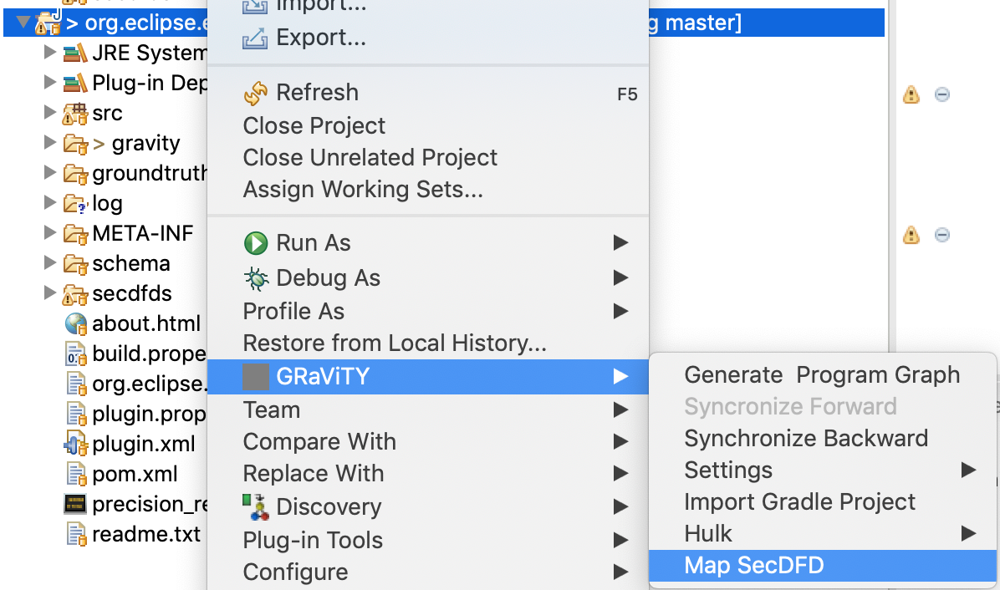
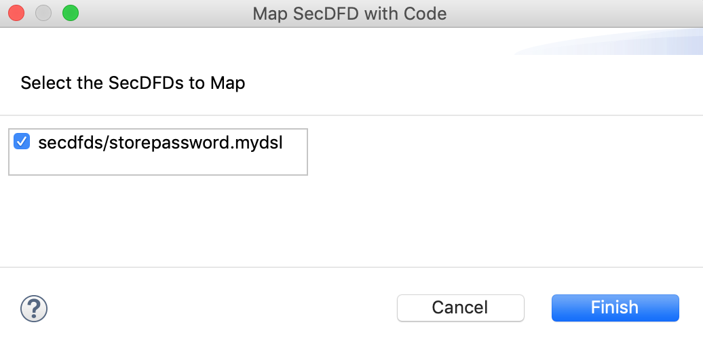
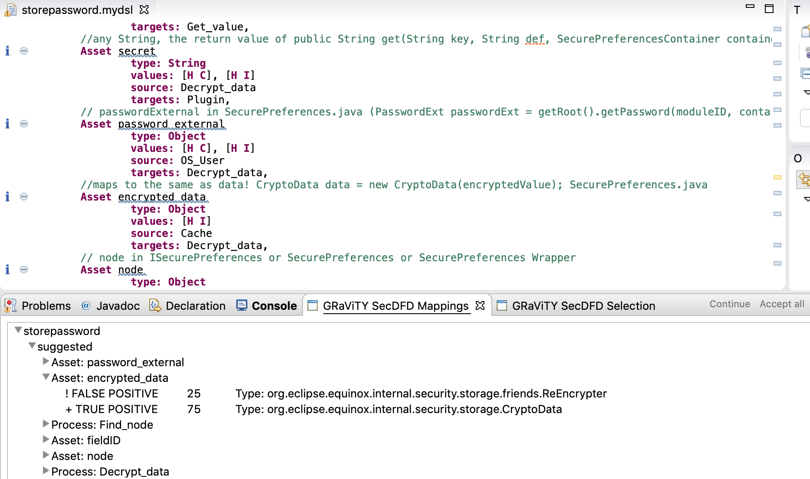
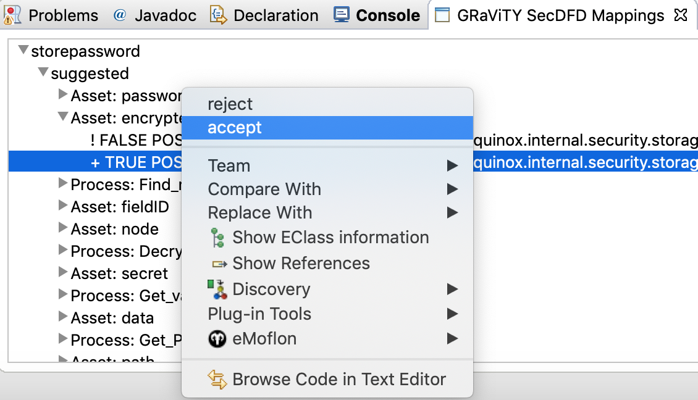
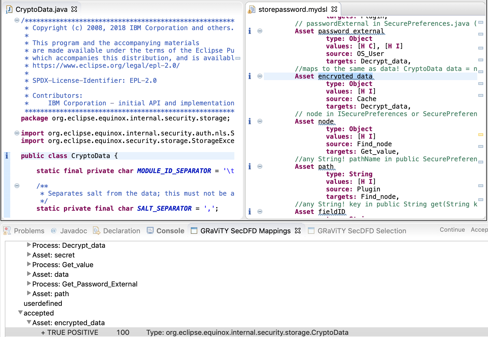
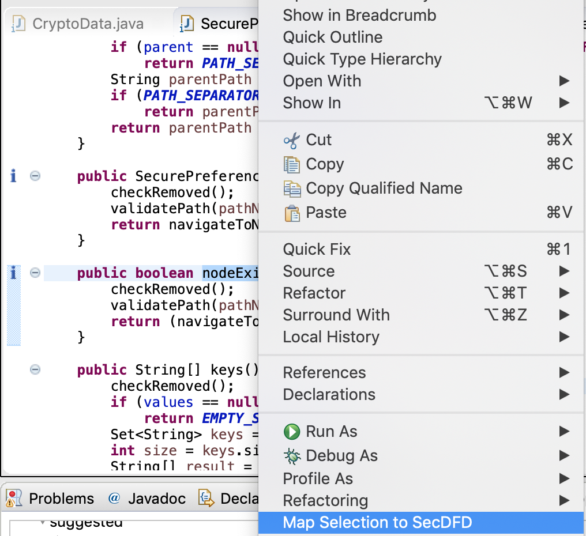
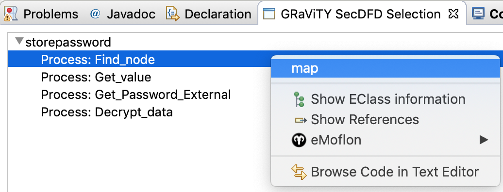

# GRaViTY-SecDFD-Mapping

This repository contains the implementation and evaluation data for our 2019 MODELS paper on Secure Data-Flow Compliance Checks between Models and Code based on Automated Mappings.

## Publication

Our paper will be presented between 18th and 20th September 2019 at [MODELS](http://modelsconference.org) in Munich.

For a precise schedule and more information please refer to the conference website: http://modelsconference.org

### Paper and Preprint

[Sven Peldszus](http://sven.peldszus.com), Katja Tuma, Daniel Strüber, Jan Jürjens, Riccardo Scandariato: *Secure Data-Flow Compliance Checks between Models and Code based on Automated Mappings*. In: Proceedings of the 22nd ACM/IEEE International Conference on Model Driven Engineering Languages and Systems (MODELS), 2019. to appear. 

The preprint is available [here](http://rgse.uni-koblenz.de/web/pages/people/peldszus/publications/PTS+19-MODELS-SecureData-FlowComplianceChecksBetweenModelsAndCodeBasedOnAutomatedMappings.pdf)

### Abstract

During the development of security-critical software, the system implementation must capture the security properties postulated by the architectural design. In our MODELS 2019 paper, we present an approach to support secure data-flow compliance checks between design models and code. To iteratively guide the developer in discovering such compliance violations we introduce automated mappings. These mappings are created by searching for correspondences between a design-level model (Security Data Flow Diagram) and an implementation-level model ([Program Model](https://gravity-tool.org)). We limit the search space by considering name similarities between model elements and code elements as well as by the use of heuristic rules for matching data-flow structures. The main contributions of this paper are three-fold. First, the automated mappings support the designer in an early discovery of implementation absence, convergence, and divergence with respect to the planned software design. Second, the mappings also support the discovery of secure data-flow compliance violations in terms of illegal asset flows in the software implementation. Third, we present our implementation of the approach as a publicly available Eclipse plugin and its evaluation on five open source Java projects (including Eclipse secure storage).

## How to use the Tool

To use our tool at first open the Java perspective of Eclipse. The context menus added by us are only visible in the "Package Explorer" of this view.

Afterwards you can right click on any project and select "GRaViTY" -> "Map SecDFD". This will open a dialog showing all DFD with the selected project and allow you to select the model you want to map to the code. 
After clicking finish it might take some time to build a program model and to analyze the code until a new view called "GRaViTY SecDFD Mappings" will be opened.

In this view you all suggested mappings are presented and you can accept or reject them by right clicking on a mapping and selecting "accept" or "reject". In addition information and warning markers are shown on the Java source code files and the SecDFD model stating mappings and missing mappings.
If you double click on a mapping in the "GRaViTY SecDFD Mappings" view and the according Java element is contained in the selected project it's "*.java" file will be opened.

Manual mappings can be added by placing the mouse cursor on the Java element you want to map to the DFD, right clicking and selecting "Map Selection to SecDFD". This will open a view called "GRaViTY SecDFD Selection" showing possible elements from the SecDFD. You can create a new mapping by right clicking on one of those elements and selecting "map". This step might lead to new suggested mappings based on your manual mapping.

After you accepted, rejected or added elements you can click on continue in the "GRaViTY SecDFD Mappings" view to get more automated suggestions.

A more detailed description how to use the tool will be added soon.

A short description is contained in Section IV. - Implementation - of the paper: [preprint](http://rgse.uni-koblenz.de/web/pages/people/peldszus/publications/PTS+19-MODELS-SecureData-FlowComplianceChecksBetweenModelsAndCodeBasedOnAutomatedMappings.pdf)

## Installation

The prototypical implementation of the GRaViTY-SecDFD-Maopping-Tool can be installed into Eclipse from the following updatesite:

https://gravity-tool.org/secdfd-mapper/updatesite/

If you are using an Eclipse newer that 2018-09, please install the MoDisco SDK from the Eclipse 2019-09 build before installing our tool:

updatesite: http://download.eclipse.org/releases/2018-09

## Building the Tool

In what follows we describe how the prototypical implementation can be built.

## Structure of this Repository

- `build/` -- The feature project and the updatesite project (The updatesite is hosted [here](https://gravity-tool.org/secdfd-mapper/updatesite/))
- `examples/` -- The examples used for the evaluation
- `implementation/` -- The source code of the prorotypical implementation
- `README.md` -- This readme

### Requirements

To build the tool an Eclipse including the following plugins is required:

- The GRaViTY program model and a transformation engine from: https://gravity-tool.org/updatesite
- Xtext from the Eclipse standard repository: https://download.eclipse.org/modeling/tmf/xtext/updates/composite/releases/

### Build

To built the tool the Eclipse projects from the `implementation/` and the `build` folder of this repository have to be imported into the eclipse workspace. Afterwards the updatesite can be built by opening `org.gravity.mapping.secdfd.updatesite/site.xml` and selecting 'Build All'. Alternatively, the plugins can be installed into the running instance according to the following manual: [Export and Install into the Running Host](https://help.eclipse.org/2019-03/index.jsp?topic=%2Forg.eclipse.pde.doc.user%2Ftasks%2Fui_export_install_into_host.htm)
